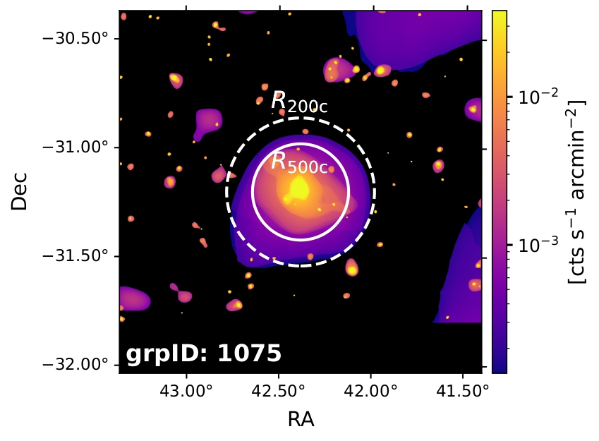
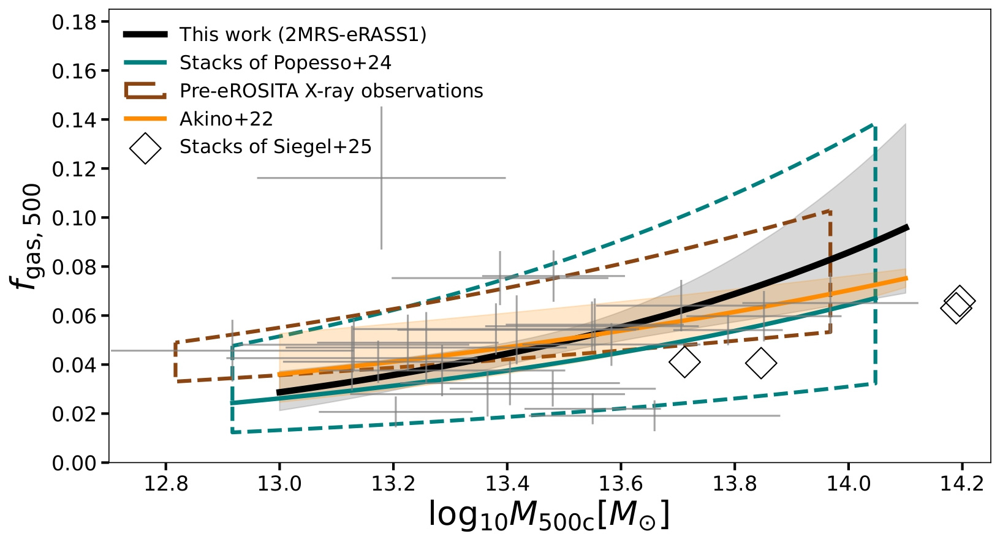
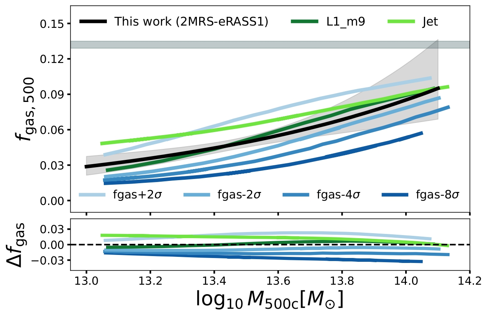
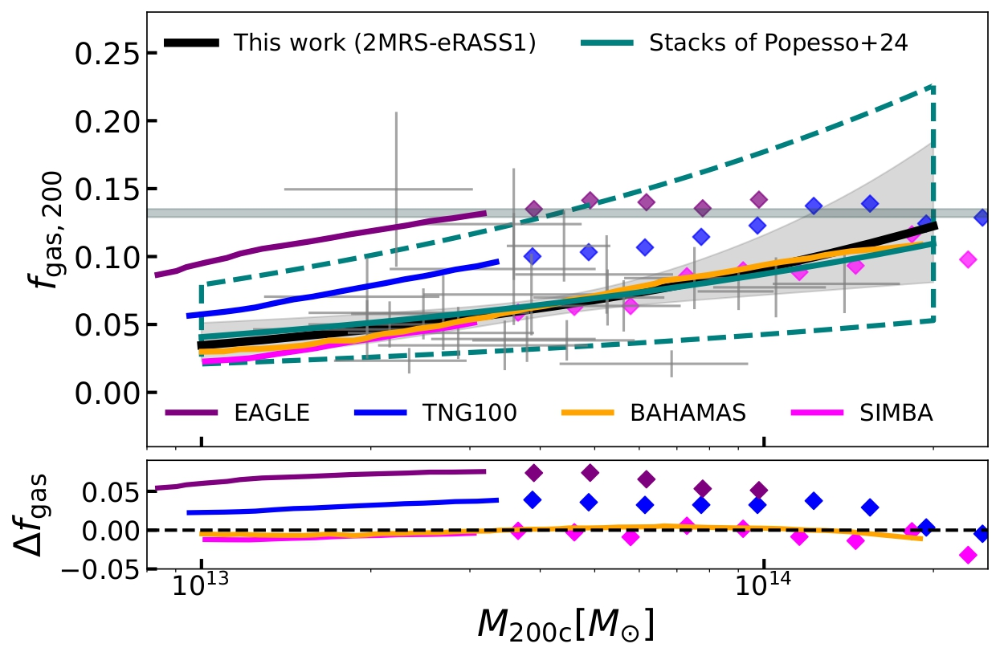
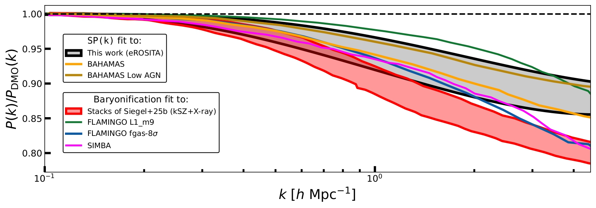
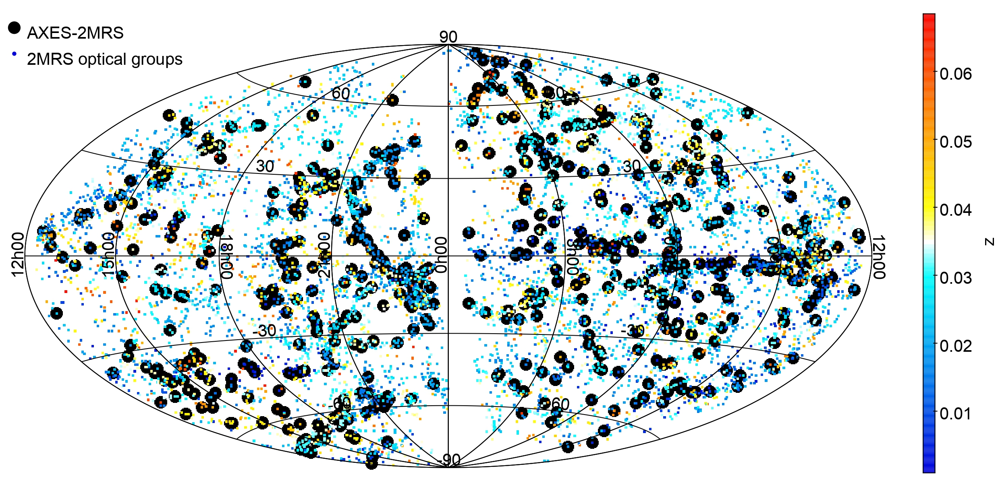

My research focus is observational X-ray astronomy of galaxy clusters. I use data from space-based X-ray missions combined with ground-based optical data to probe the hot intergalactic plasma that is making up more than 90% of all normal matter (baryons) in our Universe. 

{#cluster fig-align="center" width="70%"}

---

## How AGN feedback modifies the baryonic content of galaxy groups with eROSITA (Khalil et al. in prep.)
In this project, we use a well-selected sample from the first public release of eROSITA-DE data from the western Galactic hemisphere ([eRASS1](https://erosita.mpe.mpg.de/dr1/)) identified with the optical 2MASS Redshift survey galaxy gorup catalogue ([2MRS](https://arxiv.org/abs/1806.04469)). We convert the observed surface brightness into emission measure profiles, then deproject the latter to infer the hot gas mass up to $R_{\mathrm{200c}}$.
 

### Gas fraction at $R_{\rm 500c}$

{#fg_m500 fig-align="center" width="100%"}
 
Our results rule out strong AGN feedback models as implemented in the FLAMINOG suite of hydrodynamical simulations.
{#fg_m500_flamingo fig-align="center" width="100%" height="30%"}
 

### Gas fraction at $R_{\rm 200c}$

{#fg_m200 fig-align="center" width="100%"}

### Suppression of the matter power spectrum
We can use our resuls to infer the suppression of the matter power spectrum on the Universe implied by our $(f_{\rm gas}+f_{\star})-M$ relation, where we complemented our results with [Leauthaud et al. (2012)](https://arxiv.org/abs/1109.0010)'s stellar fractions.
{#mps fig-align="center" width="100%"}

## AXES-2MRS [(Khalil et al. 2024)](https://ui.adsabs.harvard.edu/abs/2024A%26A...690A.212K/abstract)
In my master's thesis, we introduced AXES-2MRS, a new all-sky catalogue of galaxy groups detected in the ROSAT all-sky survey (RASS) and identified with 2MRS. We studied its dynamical and kinematic characteristics and constructed X-ray scaling relations for an XMM-Newton-selected subsample.
{#sky_axes fig-align="center" width="100%"}

